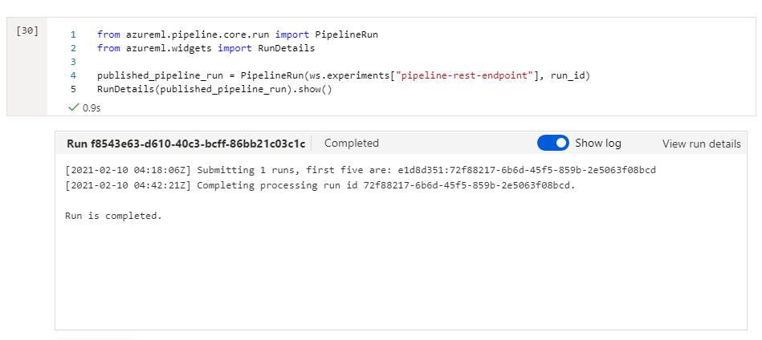

# Operationalizing Machine Learning - Bank Marketing

# Table of Contents
1. [Overview](#overview)
2. [Architectural Diagram](#architecture)
3. [Future Work](#future-work)
4. [Key Steps](#screenshots)
	1. [MLStudio](#ml-studio)
	2. [Jupyter Notebook](#jupyter)
5. [Screencast Link](#screencast)
6. [Standout Suggestions](#standsugg)

## Overview <a name="overview" />
This project is a part of the Udacity Azure ML Nanodegree.
The main goal of this project was to demonstrate the capabilities of Azure ML Studio regarding authentication, deployment and endpoint consumption.
In this project, we build and deploy a model in two different ways: via the Azure ML Studio and via the Azure Python SDK. There is an emphasis on proper security and authentication as well as making sure that as an endpoint is deployed,
it can be properly monitored with sufficient and meaningful logs. The model created is then deployed and consumed using Swagger, taking JSON payloads and returning appropriate results.
Finally, a screencast showcasing the entire process of the working ML application was made.

## Architectural Diagram <a name="architecture" />

	 
## Future Work <a name="future-work" />

## Key Steps <a name="screenshots" />
**ML Studio Steps** <a name="ml-studio" />
*TODO*: Write a short discription of the key steps. Remeber to include all the screenshots required to demonstrate key steps. 

	 
**Jupyter Notebook Steps** <a name="jupyter" />

	 

	 
## Screencast Link <a name="screencast" />
**https://youtu.be/LDm8n7IbfDA**

## Standout Suggestions <a name="standsugg" />
*TODO (Optional):* This is where you can provide information about any standout suggestions that you have attempted.
